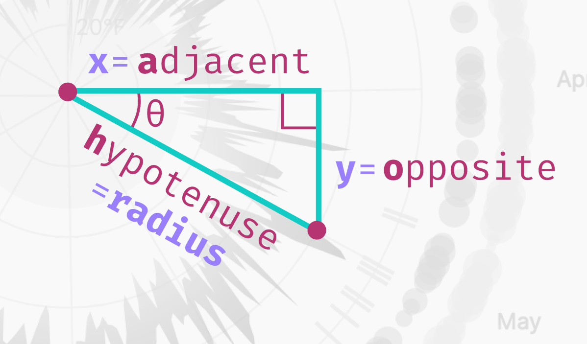
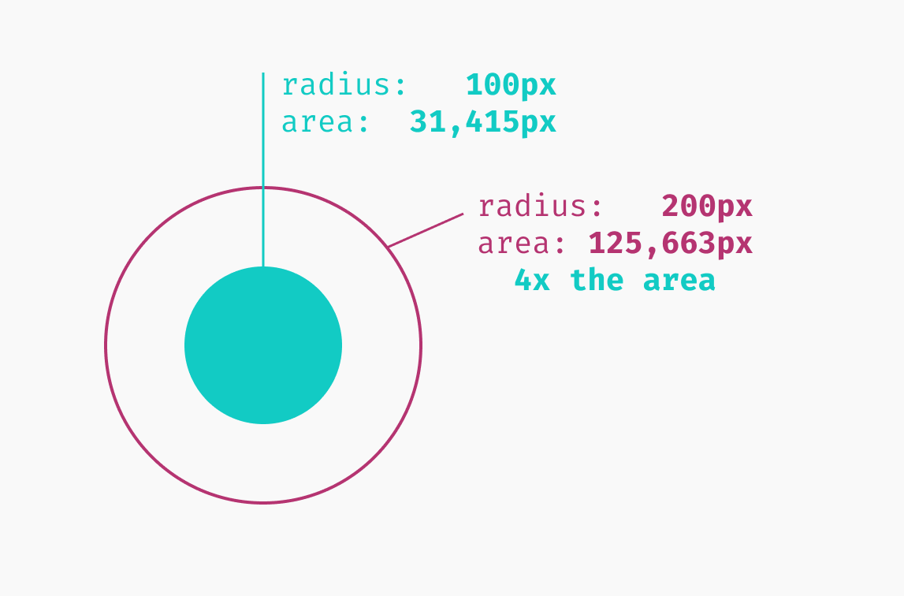
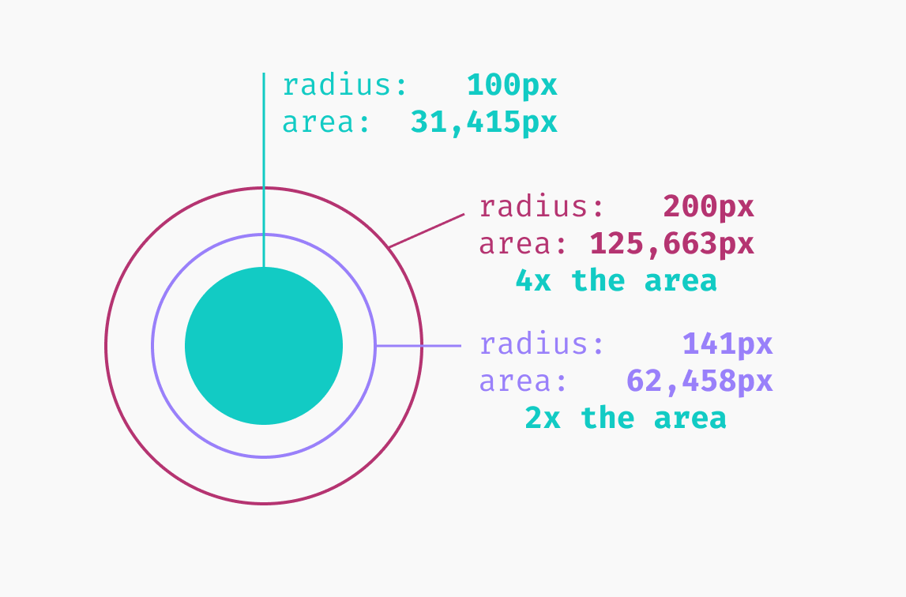

# Radar Weather Chart

We'll create this [circular radar chart](https://dataviz-exercises.netlify.app/radar-chart/index.html) showing overall weather for the whole year. It will give the viewer a sense of overall weather for the whole year, and will highlight trends such as:

- What time of the year is cloudiest, and does that correlate with the coldest days?
- Do cloudy days have lower UV indices, or are they rainier?
- How does weather vary per season?

We'll reinforce concepts we've already learned as well as introduce concepts such as angular math.

## Getting set up

A few of the steps have already been completed (they should be familiar by now): we've grabbed our data, created square dimensions, and drawn our canvas.

Note that we have a `boundedRadius` as part of the dimensions object:

```js
async function drawChart() {
  // 1. Access data
  let dataset = await d3.json("./data/my_weather_data.json");

  // 2. Create chart dimensions
  const width = 600;
  let dimensions = {
    width: width,
    height: width,
    radius: width / 2,
    margin: {
      top: 120,
      right: 120,
      bottom: 120,
      left: 120,
    },
  };
  dimensions.boundedWidth =
    dimensions.width - dimensions.margin.left - dimensions.margin.right;
  dimensions.boundedHeight =
    dimensions.height - dimensions.margin.top - dimensions.margin.bottom;
  dimensions.boundedRadius =
    dimensions.radius - (dimensions.margin.left + dimensions.margin.right) / 2;

  // 3. Draw canvas
  const wrapper = d3
    .select("#wrapper")
    .append("svg")
    .attr("width", dimensions.width)
    .attr("height", dimensions.height);

  const bounds = wrapper
    .append("g")
    .style(
      "transform",
      `translate(${dimensions.margin.left}px, ${dimensions.margin.top}px)`
    );

  // 4. Create scales

  // 5. Draw data

  // 6. Draw peripherals

  // 7. Set up interactions
}

drawChart();
```

## Accessing the Data

I've logged the first data point to the console:

```js
const dataset = await d3.json("./data/my_weather_data.json");
console.table(dataset[0]);
```

Since we already [know what our final chart will look like](https://dataviz-exercises.netlify.app/radar-chart/index.html), we can pull out all of the metrics we'll need.

Create an accessor for each of the metrics: `min temperature, max temperature, precipitation, cloud cover, uv, and date with a date parser`.

```js
const temperatureMinAccessor = (d) => d.temperatureMin;
const temperatureMaxAccessor = (d) => d.temperatureMax;
const uvAccessor = (d) => d.uvIndex;
const precipitationProbabilityAccessor = (d) => d.precipProbability;
const precipitationTypeAccessor = (d) => d.precipType;
const cloudAccessor = (d) => d.cloudCover;
const dateParser = d3.timeParse("%Y-%m-%d");
const dateAccessor = (d) => dateParser(d.date);
```

## Creating Scales

Create scales to convert our weather metrics into physical properties so we know where to draw our data elements.

The location of a data element around the radar chart's center corresponds to its date. Let's create a scale that converts a date into an angle.

```js
// 4. Create scales

const angleScale = d3
  .scaleTime()
  .domain(d3.extent(dataset, dateAccessor))
  .range([0, Math.PI * 2]); // this is in radians
```

> Note that we're using radians, instead of degrees. Angular math is generally easier with radians, and we'll want to use `Math.sin()` and `Math.cos()` later, which deals with radians. There are `2π` radians in a full circle. If you want to know more about radians, the [Wikipedia entry](https://en.wikipedia.org/wiki/Radian) is a good source.


Code:

```js
async function drawChart() {
  // 1. Access data
  let dataset = await d3.json("./data/my_weather_data.json");

  const temperatureMinAccessor = (d) => d.temperatureMin;
  const temperatureMaxAccessor = (d) => d.temperatureMax;
  const uvAccessor = (d) => d.uvIndex;
  const precipitationProbabilityAccessor = (d) => d.precipProbability;
  const precipitationTypeAccessor = (d) => d.precipType;
  const cloudAccessor = (d) => d.cloudCover;
  const dateParser = d3.timeParse("%Y-%m-%d");
  const dateAccessor = (d) => dateParser(d.date);

  // 2. Create chart dimensions
  const width = 600;
  let dimensions = {
    width: width,
    height: width,
    radius: width / 2,
    margin: {
      top: 120,
      right: 120,
      bottom: 120,
      left: 120,
    },
  };

  dimensions.boundedWidth =
    dimensions.width - dimensions.margin.left - dimensions.margin.right;
  dimensions.boundedHeight =
    dimensions.height - dimensions.margin.top - dimensions.margin.bottom;
  dimensions.boundedRadius =
    dimensions.radius - (dimensions.margin.left + dimensions.margin.right) / 2;

  // 3. Draw canvas
  const wrapper = d3
    .select("#wrapper")
    .append("svg")
    .attr("width", dimensions.width)
    .attr("height", dimensions.height);

  const bounds = wrapper
    .append("g")
    .style(
      "transform",
      `translate(${dimensions.margin.left}px, ${dimensions.margin.top}px)`
    );

  // 4. Create scales

  const angleScale = d3
    .scaleTime()
    .domain(d3.extent(dataset, dateAccessor))
    .range([0, Math.PI * 2]); // this is in radians

  // 5. Draw data

  // 6. Draw peripherals

  // 7. Set up interactions
}

drawChart();
```

## Adding Gridlines

We're going to skip step 5 and use step 6 to get our feet wet with angular math. We'll draw angular grid lines for each month, circular grid lines for temperature, and label both axes.

To get our feet wet with this angular math, we'll draw our peripherals before we draw our data elements.

Switch those steps in our code:

```js
// 6. Draw peripherals

// 5. Draw data
```

Drawing the grid lines first is helpful in cases like this where we want our data elements to layer on top. If we wanted to keep our steps in order, we could also create a `<g>` element first to add our grid lines to after.

Creating a group to hold our grid elements keeps our elements organized:

```js
const peripherals = bounds.append("g");
```

## Draw Month Grid Lines

Create one "spoke" for each month in our dataset. First, we'll need to create an array of each month. We already know what our first and last dates are - the `.domain()` of our `angleScale`. But how can we create a list of each month between those two dates?

The [d3-time module](https://github.com/d3/d3-time#intervals) has various intervals, which represent various units of time. For example, `d3.timeMinute()` represents every minute and `d3.timeWeek()`represents every week.

```js
const months = d3.timeMonths(...angleScale.domain());
console.log(months);
```

Now we have an array of datetime objects corresponding to the beginning of each month in our dataset.

Let's use our array of months and draw one `<line>` per month:

```js
const gridLines = months.forEach((month) => {
  return peripherals.append("line");
});
```

We'll need to find the angle for each month - use the `angleScale` to convert the date into an angle:

```js
const gridLines = months.forEach((month) => {
  const angle = angleScale(month);
  console.log("angle", angle);
  return peripherals.append("line");
});
```

Each spoke will start in the middle of our chart - we could start those lines at `[dimensions.boundedRadius, dimensions.boundedRadius]`, but most of our element will need to be shifted in respect to the center of our chart.

Remember how we use our bounds to shift our chart according to our top and left margins?

To make our math simpler, let's instead shift our bounds to start in the center of our chart.

This will help us when we decide where to place our data and peripheral elements - we'll only need to know where they lie with respect to the center of our circle.

Edit the bounds to center it:

```js
const bounds = wrapper
  .append("g")
  .style(
    "transform",
    `translate(${dimensions.margin.left + dimensions.boundedRadius}px, ${
      dimensions.margin.top + dimensions.boundedRadius
    }px)`
  );
```

We'll need to convert from angle to `[x, y]` coordinate many times in this chart. Let's create a function that makes that conversion for us. Our function will take two parameters:

1. the angle
2. the offset

and return the `[x,y]` coordinates of a point rotated angle radians around the center, and offset time our circle's radius (`dimensions.boundedRadius`). This will give us the ability to draw elements at different radii (for example, to draw our precipitation bubbles slightly outside of our temperature chart, we'll offset them by 1.14 times our normal radius length).

Add this line after the `angleScale`:

```js
const getCoordinatesForAngle = (angle, offset = 1) => [];
```

To convert an angle into a coordinate, we'll dig into our knowledge of trigonometry. Let's look at the right-angle triangle (a triangle with a 90-degree angle) created by connecting our origin point (`[0,0]`) and our destination point (`[x,y]`).



The numbers we already know are theta (`θ`) and the hypotenuse (`dimensions.boundedRadius * offset`). We can use these numbers to calculate the lengths of the adjacent and opposite sides of our triangle, which will correspond to the `x` and `y` position of our destination point.

Because our triangle has a right angle, we can multiply the sine and cosine of our angle by the length of our hypotenuse to calculate our x and y values.

Let's implement this in the `getCoordinatesForAngle()` function:

```js
const getCoordinatesForAngle = (angle, offset = 1) => [
  Math.cos(angle) * dimensions.boundedRadius * offset,
  Math.sin(angle) * dimensions.boundedRadius * offset,
];
```

We have to make one more tweak to our `getCoordinatesForAngle()` function - an angle of 0 would draw a line horizontally to the right of the origin point. But our radar chart starts in the center, above our origin point. Let's rotate our angles by `1/4` turn to return the correct points.

> Remember that there are 2π radians in one full circle, so 1/4 turn would be 2π / 4, or π / 2.

```js
const getCoordinatesForAngle = (angle, offset = 1) => [
  Math.cos(angle - Math.PI / 2) * dimensions.boundedRadius * offset,
  Math.sin(angle - Math.PI / 2) * dimensions.boundedRadius * offset,
];
```

That was a a lot of math. Now let's use it to draw our grid lines.

If we move back down in our chart.js file, let's grab the x and y coordinates of the end of our spokes and set our `<line>`s' x2 and y2 attributes.

> We don't need to set the x1 or y1 attributes of our line because they both default to 0.

```js
months.forEach((month) => {
  const angle = angleScale(month);
  const [x, y] = getCoordinatesForAngle(angle);

  peripherals
    .append("line")
    .attr("x2", x)
    .attr("y2", y)
    .attr("class", "grid-line");
});
```

Give the lines a stroke color in `styles.css`:

```css
.grid-line {
  stroke: #dadadd;
}
```

We have 12 spokes to show where each of the months in our chart start.

## Draw Month Labels

Our viewers won't know which month each spoke is depicting - let's label each of our spokes. While we're looping over our months, let's also get the `[x, y]` coordinates of a point 1.38 times our chart's radius away from the center of our chart. This will give us room to draw the rest of our chart within our month labels.

```js
months.forEach((month) => {
  const angle = angleScale(month);
  const [x, y] = getCoordinatesForAngle(angle);

  peripherals
    .append("line")
    .attr("x2", x)
    .attr("y2", y)
    .attr("class", "grid-line");

  // NEW
  const [labelX, labelY] = getCoordinatesForAngle(angle, 1.38);
  peripherals
    .append("text")
    .attr("x", labelX)
    .attr("y", labelY)
    .attr("class", "tick-label")
    .text(d3.timeFormat("%b")(month));
});
```

We can see our month labels now, but there's one issue: the labels on the left are closer to our spokes than the labels on the right.

This is because our `<text>` elements are anchored by their left side. Let's dynamically set their text-anchor property, depending on the label's x position. We'll align labels on the left by the end of the text, and labels near the center by their middle.

> Note: text-anchor is essentially the text-align CSS property for SVG elements.

```js
.text(d3.timeFormat("%b")(month))
.style("text-anchor",
  Math.abs(labelX) < 5 ? "middle" :
  labelX > 0           ? "start"  :
                         "end"
)
```

Our labels also aren't centered vertically with our spokes. Let's center them, using dominant-baseline, and update their styling to decrease their visual weight. We want our labels to orient our users, but not to distract from our data.

```css
.tick-label {
  dominant-baseline: middle;
  fill: #8395a7;
  font-size: 0.7em;
  font-weight: 900;
  letter-spacing: 0.005em;
}
```

## Adding Temperature Grid Lines

Our final chart has circular grid marks that mark different temperatures. Before we add this, we need a temperature scale that converts a temperature to a radius. Higher temperatures are drawn further from the center of our chart.

Let's add a `radiusScale` at the end of the scales section. We'll want to use `nice()` to give us friendlier minimum and maximum values, since the exact start and end doesn't matter. Note that we didn't use `.nice()` to round the edges of our `angleScale`, since we want it to start and end exactly with its range.

```js
const radiusScale = d3
  .scaleLinear()
  .domain(
    d3.extent([
      ...dataset.map(temperatureMaxAccessor),
      ...dataset.map(temperatureMinAccessor),
    ])
  )
  .range([0, dimensions.boundedRadius])
  .nice();
```

> We're using the ES6 spread operator (`...`) to spread our arrays of min and max temperatures so we get one flat array with both arrays concatenated. If you're unfamiliar with this syntax read more [here](https://developer.mozilla.org/en-US/docs/Web/JavaScript/Reference/Operators/Spread_syntax).

We'll be converting a single data point into an x or y value many times - let's create two utility functions to help us to do just that. It's nice to have this logic in one place and not cluttering our `.attr()` functions.

```js
const getXFromDataPoint = (d, offset = 1.4) =>
  getCoordinatesForAngle(angleScale(dateAccessor(d)), offset)[0];
const getYFromDataPoint = (d, offset = 1.4) =>
  getCoordinatesForAngle(angleScale(dateAccessor(d)), offset)[1];
```

Put this scale to use. At the end of our Draw peripherals step, let's add a few circle grid lines that correspond to temperatures within our radiusScale

```js
const temperatureTicks = radiusScale.ticks(4);
const gridCircles = temperatureTicks.map((d) =>
  peripherals
    .append("circle")
    .attr("r", radiusScale(d))
    .attr("class", "grid-line")
);
```

Since `<circle>` elements default to a black fill, we won't be able to see much.

Add some styles to remove the fill from any `.grid-line` elements and add a faint stroke:

```css
.grid-line {
  fill: none;
  stroke: #dadadd;
}
```

Now we can see our concentric circles on our chart.

Similar to our month lines, we'll need labels to tell our viewers what temperature each of these circles represents.

```js
const tickLabels = temperatureTicks.map((d) => {
  if (!d) return;
  return peripherals
    .append("text")
    .attr("x", 4)
    .attr("y", -radiusScale(d) + 2)
    .attr("class", "tick-label-temperature")
    .text(`${d3.format(".0f")(d)}°F`);
});
```

> Notice that we're returning early if `d` is falsey - we don't want to make a label for a temperature of `0`.

We'll need to vertically center and dim our labels - update the `.tick-label-temperature` elements in `styles.css`:

```css
.tick-label-temperature {
  fill: #8395a7;
  opacity: 0.7;
  font-size: 0.7em;
  dominant-baseline: middle;
}
```

The labels are very helpful, but they're a little hard to read on top of our grid lines.

Add a `<rect>` behind our labels that's the same color as the background of our page. We'll need to add this code _before we draw our tickLabels and after our gridCircles_, since SVG stacks elements in the order we draw them.

```js
const tickLabelBackgrounds = temperatureTicks.map((d) => {
  if (!d) return;
  return peripherals
    .append("rect")
    .attr("y", -radiusScale(d) - 10)
    .attr("width", 40)
    .attr("height", 20)
    .attr("fill", "#f8f9fa");
});
```

Code:

```js
async function drawChart() {
  // 1. Access data

  let dataset = await d3.json("./data/my_weather_data.json");
  console.log(dataset[3]);

  const temperatureMinAccessor = (d) => d.temperatureMin;
  const temperatureMaxAccessor = (d) => d.temperatureMax;
  const uvAccessor = (d) => d.uvIndex;
  const precipitationProbabilityAccessor = (d) => d.precipProbability;
  const precipitationTypeAccessor = (d) => d.precipType;
  const cloudAccessor = (d) => d.cloudCover;
  const dateParser = d3.timeParse("%Y-%m-%d");
  const dateAccessor = (d) => dateParser(d.date);

  // 2. Create chart dimensions

  const width = 600;
  let dimensions = {
    width: width,
    height: width,
    radius: width / 2,
    margin: {
      top: 120,
      right: 120,
      bottom: 120,
      left: 120,
    },
  };
  dimensions.boundedWidth =
    dimensions.width - dimensions.margin.left - dimensions.margin.right;
  dimensions.boundedHeight =
    dimensions.height - dimensions.margin.top - dimensions.margin.bottom;
  dimensions.boundedRadius =
    dimensions.radius - (dimensions.margin.left + dimensions.margin.right) / 2;

  // 3. Draw canvas

  const wrapper = d3
    .select("#wrapper")
    .append("svg")
    .attr("width", dimensions.width)
    .attr("height", dimensions.height);

  const bounds = wrapper
    .append("g")
    .style(
      "transform",
      `translate(${dimensions.margin.left + dimensions.boundedRadius}px, ${
        dimensions.margin.top + dimensions.boundedRadius
      }px)`
    );

  // 4. Create scales

  const angleScale = d3
    .scaleTime()
    .domain(d3.extent(dataset, dateAccessor))
    .range([0, Math.PI * 2]);

  const radiusScale = d3
    .scaleLinear()
    .domain(
      d3.extent([
        ...dataset.map(temperatureMinAccessor),
        ...dataset.map(temperatureMaxAccessor),
      ])
    )
    .range([0, dimensions.boundedRadius])
    .nice();

  const getCoordinatesForAngle = (angle, offset = 1) => [
    Math.cos(angle - Math.PI / 2) * dimensions.boundedRadius * offset,
    Math.sin(angle - Math.PI / 2) * dimensions.boundedRadius * offset,
  ];
  const getXFromDataPoint = (d, offset = 1.4) =>
    getCoordinatesForAngle(angleScale(dateAccessor(d)), offset)[0];
  const getYFromDataPoint = (d, offset = 1.4) =>
    getCoordinatesForAngle(angleScale(dateAccessor(d)), offset)[1];

  // 6. Draw peripherals

  const peripherals = bounds.append("g");
  const months = d3.timeMonth.range(...angleScale.domain());

  months.forEach((month) => {
    const angle = angleScale(month);
    const [x, y] = getCoordinatesForAngle(angle, 1);

    peripherals
      .append("line")
      .attr("x2", x)
      .attr("y2", y)
      .attr("class", "grid-line");

    const [labelX, labelY] = getCoordinatesForAngle(angle, 1.38);
    peripherals
      .append("text")
      .attr("x", labelX)
      .attr("y", labelY)
      .attr("class", "tick-label")
      .text(d3.timeFormat("%b")(month))
      .style(
        "text-anchor",
        Math.abs(labelX) < 5 ? "middle" : labelX > 0 ? "start" : "end"
      );
  });

  const temperatureTicks = radiusScale.ticks(4);
  const gridCircles = temperatureTicks.map((d) => {
    peripherals
      .append("circle")
      .attr("r", radiusScale(d))
      .attr("class", "grid-line");
  });

  const tickLabelBackgrounds = temperatureTicks.map((d) => {
    if (d < 1) return;
    return peripherals
      .append("rect")
      .attr("y", -radiusScale(d) - 10)
      .attr("width", 40)
      .attr("height", 20)
      .attr("fill", "#f8f9fa");
  });

  const gridLabels = temperatureTicks.map((d) => {
    if (d < 1) return;
    return peripherals
      .append("text")
      .attr("x", 4)
      .attr("y", -radiusScale(d) + 2)
      .attr("class", "tick-label-temperature")
      .html(`${d3.format(".0f")(d)}°F`);
  });

  // 5. Draw data

  // 7. Set up interactions
}
drawChart();
```

## Adding Freezing

To ease into our drawing data step by drawing a `<circle>` to show where freezing is on our chart. We'll want to write this code in our Draw data step.

We can first check if our temperatures drop low enough:

```js
const containsFreezing = radiusScale.domain()[0] < 32;
```

If our temperatures do drop below freezing, we'll add a `<circle>` whose radius ends at 32 degrees Fahrenheit.

```js
if (containsFreezing) {
  const freezingCircle = bounds
    .append("circle")
    .attr("r", radiusScale(32))
    .attr("class", "freezing-circle");
}
```

Set the fill color and opacity of our circle to be a light cyan:

```css
.freezing-circle {
  fill: #00d2d3;
  opacity: 0.15;
}
```

Now we can see where the freezing temperatures will lie on our chart.

Code:

```js
async function drawChart() {
  // 1. Access data

  let dataset = await d3.json("./data/my_weather_data.json");
  console.log(dataset[3]);

  const temperatureMinAccessor = (d) => d.temperatureMin;
  const temperatureMaxAccessor = (d) => d.temperatureMax;
  const uvAccessor = (d) => d.uvIndex;
  const precipitationProbabilityAccessor = (d) => d.precipProbability;
  const precipitationTypeAccessor = (d) => d.precipType;
  const cloudAccessor = (d) => d.cloudCover;
  const dateParser = d3.timeParse("%Y-%m-%d");
  const dateAccessor = (d) => dateParser(d.date);

  // 2. Create chart dimensions

  const width = 600;
  let dimensions = {
    width: width,
    height: width,
    radius: width / 2,
    margin: {
      top: 120,
      right: 120,
      bottom: 120,
      left: 120,
    },
  };
  dimensions.boundedWidth =
    dimensions.width - dimensions.margin.left - dimensions.margin.right;
  dimensions.boundedHeight =
    dimensions.height - dimensions.margin.top - dimensions.margin.bottom;
  dimensions.boundedRadius =
    dimensions.radius - (dimensions.margin.left + dimensions.margin.right) / 2;

  // 3. Draw canvas

  const wrapper = d3
    .select("#wrapper")
    .append("svg")
    .attr("width", dimensions.width)
    .attr("height", dimensions.height);

  const bounds = wrapper
    .append("g")
    .style(
      "transform",
      `translate(${dimensions.margin.left + dimensions.boundedRadius}px, ${
        dimensions.margin.top + dimensions.boundedRadius
      }px)`
    );

  // 4. Create scales

  const angleScale = d3
    .scaleTime()
    .domain(d3.extent(dataset, dateAccessor))
    .range([0, Math.PI * 2]);

  const radiusScale = d3
    .scaleLinear()
    .domain(
      d3.extent([
        ...dataset.map(temperatureMinAccessor),
        ...dataset.map(temperatureMaxAccessor),
      ])
    )
    .range([0, dimensions.boundedRadius])
    .nice();

  const getCoordinatesForAngle = (angle, offset = 1) => [
    Math.cos(angle - Math.PI / 2) * dimensions.boundedRadius * offset,
    Math.sin(angle - Math.PI / 2) * dimensions.boundedRadius * offset,
  ];
  const getXFromDataPoint = (d, offset = 1.4) =>
    getCoordinatesForAngle(angleScale(dateAccessor(d)), offset)[0];
  const getYFromDataPoint = (d, offset = 1.4) =>
    getCoordinatesForAngle(angleScale(dateAccessor(d)), offset)[1];

  // 6. Draw peripherals

  const peripherals = bounds.append("g");
  const months = d3.timeMonth.range(...angleScale.domain());

  months.forEach((month) => {
    const angle = angleScale(month);
    const [x, y] = getCoordinatesForAngle(angle, 1);

    peripherals
      .append("line")
      .attr("x2", x)
      .attr("y2", y)
      .attr("class", "grid-line");

    const [labelX, labelY] = getCoordinatesForAngle(angle, 1.38);
    peripherals
      .append("text")
      .attr("x", labelX)
      .attr("y", labelY)
      .attr("class", "tick-label")
      .text(d3.timeFormat("%b")(month))
      .style(
        "text-anchor",
        Math.abs(labelX) < 5 ? "middle" : labelX > 0 ? "start" : "end"
      );
  });

  const temperatureTicks = radiusScale.ticks(4);
  const gridCircles = temperatureTicks.map((d) => {
    peripherals
      .append("circle")
      .attr("r", radiusScale(d))
      .attr("class", "grid-line");
  });

  const tickLabelBackgrounds = temperatureTicks.map((d) => {
    if (d < 1) return;
    return peripherals
      .append("rect")
      .attr("y", -radiusScale(d) - 10)
      .attr("width", 40)
      .attr("height", 20)
      .attr("fill", "#f8f9fa");
  });

  const gridLabels = temperatureTicks.map((d) => {
    if (d < 1) return;
    return peripherals
      .append("text")
      .attr("x", 4)
      .attr("y", -radiusScale(d) + 2)
      .attr("class", "tick-label-temperature")
      .html(`${d3.format(".0f")(d)}°F`);
  });

  // 5. Draw data

  const containsFreezing = radiusScale.domain()[0] < 32;
  if (containsFreezing) {
    const freezingCircle = bounds
      .append("circle")
      .attr("r", radiusScale(32))
      .attr("class", "freezing-circle");
  }

  // 7. Set up interactions
}
drawChart();
```

## Adding the Temperature Area

We create a radial area shape, bounded by the min and max temperatures for each day. Then we create a gradient and use it to color our area.

Our finished chart has a shape that covers the minimum and maximum temperatures for each day. Our first instinct to draw an area is to use `d3.area()`, but `d3.area()` will only take an x and a y position.

Instead, we want to use `d3.areaRadial()`, which is similar to `d3.area(),` but has `.angle()` and `.radius()` methods. Since we want our area to span the minimum and maximum temperature for a day, we can use `.innerRadius()` and `.outerRadius(`) instead of one `.radius()`.

```js
const areaGenerator = d3
  .areaRadial()
  .angle((d) => angleScale(dateAccessor(d)))
  .innerRadius((d) => radiusScale(temperatureMinAccessor(d)))
  .outerRadius((d) => radiusScale(temperatureMaxAccessor(d)));
```

Like `.line()` and `.area()` generators, our `areaGenerator()` will return the `d` attribute string for a `<path>` element, given a dataset. Let's create a `<path>` element and set its `d` attribute.

```js
const area = bounds
  .append("path")
  .attr("class", "area")
  .attr("d", areaGenerator(dataset));
```

Sometimes displaying a metric in multiple ways can help focus the viewer on it and also give them two ways to encode it. Let's also visualize the temperature with a gradient.

## Drawing a Gradient

Let's create a gradient at the end of our Draw canvas step.

To make a gradient in SVG, we'll need to create a `<linearGradient>` or `<radialGradient>` SVG element.

Within that, we'll create several `<stop>` SVG elements that will tell the gradient what colors to interpolate between, using stop-color and offset attributes.

For example, this code:

```svg
<linearGradient>
  <stop stop-color="#12CBC4" offset="0%"></stop>
  <stop stop-color="#FFC312" offset="50%"></stop>
  <stop stop-color="#B53471" offset="100%"></stop>
</linearGradient>
```

> The offset's percentage value is in proportion to the element using the `<linearGradient>`.

We'll create our gradient within a `<defs>` element, to keep our code organized so we know where to find re-useable elements. Creating `<defs>` elements near the top helps organize our code - we'll know where to find elements that are re-useable.

```js
const defs = wrapper.append("defs");
```

A `<linearGradient>` is the simplest gradient, but here, we'll want to use a `<radialGradient>`.

Add this to the Draw Canvas section of our code:

```js
const defs = wrapper.append("defs");

const gradientId = "temperature-gradient";
const gradient = defs.append("radialGradient").attr("id", gradientId);
const numberOfStops = 10;
const gradientColorScale = d3.interpolateYlOrRd;
d3.range(numberOfStops).forEach((i) => {
  gradient
    .append("stop")
    .attr("offset", `${(i * 100) / (numberOfStops - 1)}%`)
    .attr("stop-color", gradientColorScale(i / (numberOfStops - 1)));
});
```

To use a gradient, all we need to do is set the fill or stroke of a SVG element to `url(#GRADIENT_ID)` (where `GRADIENT_ID` matches the gradient's `id` attribute).

Edit the area variable:

```js
const area = bounds
  .append("path")
  .attr("class", "area")
  .attr("d", areaGenerator(dataset))
  .style("fill", `url(#${gradientId})`);
```

Now we can see that our gradient re-enforces the relationship between distance from the origin and higher temperatures.

Code:

```js
async function drawChart() {
  // 1. Access data

  let dataset = await d3.json("./data/my_weather_data.json");
  console.log(dataset[3]);

  const temperatureMinAccessor = (d) => d.temperatureMin;
  const temperatureMaxAccessor = (d) => d.temperatureMax;
  const uvAccessor = (d) => d.uvIndex;
  const precipitationProbabilityAccessor = (d) => d.precipProbability;
  const precipitationTypeAccessor = (d) => d.precipType;
  const cloudAccessor = (d) => d.cloudCover;
  const dateParser = d3.timeParse("%Y-%m-%d");
  const dateAccessor = (d) => dateParser(d.date);

  // 2. Create chart dimensions

  const width = 600;
  let dimensions = {
    width: width,
    height: width,
    radius: width / 2,
    margin: {
      top: 120,
      right: 120,
      bottom: 120,
      left: 120,
    },
  };
  dimensions.boundedWidth =
    dimensions.width - dimensions.margin.left - dimensions.margin.right;
  dimensions.boundedHeight =
    dimensions.height - dimensions.margin.top - dimensions.margin.bottom;
  dimensions.boundedRadius =
    dimensions.radius - (dimensions.margin.left + dimensions.margin.right) / 2;

  // 3. Draw canvas

  const wrapper = d3
    .select("#wrapper")
    .append("svg")
    .attr("width", dimensions.width)
    .attr("height", dimensions.height);

  const bounds = wrapper
    .append("g")
    .style(
      "transform",
      `translate(${dimensions.margin.left + dimensions.boundedRadius}px, ${
        dimensions.margin.top + dimensions.boundedRadius
      }px)`
    );

  const defs = wrapper.append("defs");

  const gradientId = "temperature-gradient";
  const gradient = defs.append("radialGradient").attr("id", gradientId);
  const numberOfStops = 10;
  const gradientColorScale = d3.interpolateYlOrRd;
  d3.range(numberOfStops).forEach((i) => {
    gradient
      .append("stop")
      .attr("offset", `${(i * 100) / (numberOfStops - 1)}%`)
      .attr("stop-color", gradientColorScale(i / (numberOfStops - 1)));
  });

  // 4. Create scales

  const angleScale = d3
    .scaleTime()
    .domain(d3.extent(dataset, dateAccessor))
    .range([0, Math.PI * 2]);

  const radiusScale = d3
    .scaleLinear()
    .domain(
      d3.extent([
        ...dataset.map(temperatureMinAccessor),
        ...dataset.map(temperatureMaxAccessor),
      ])
    )
    .range([0, dimensions.boundedRadius])
    .nice();

  const getCoordinatesForAngle = (angle, offset = 1) => [
    Math.cos(angle - Math.PI / 2) * dimensions.boundedRadius * offset,
    Math.sin(angle - Math.PI / 2) * dimensions.boundedRadius * offset,
  ];
  const getXFromDataPoint = (d, offset = 1.4) =>
    getCoordinatesForAngle(angleScale(dateAccessor(d)), offset)[0];
  const getYFromDataPoint = (d, offset = 1.4) =>
    getCoordinatesForAngle(angleScale(dateAccessor(d)), offset)[1];

  // 6. Draw peripherals

  const peripherals = bounds.append("g");
  const months = d3.timeMonth.range(...angleScale.domain());

  months.forEach((month) => {
    const angle = angleScale(month);
    const [x, y] = getCoordinatesForAngle(angle, 1);

    peripherals
      .append("line")
      .attr("x2", x)
      .attr("y2", y)
      .attr("class", "grid-line");

    const [labelX, labelY] = getCoordinatesForAngle(angle, 1.38);
    peripherals
      .append("text")
      .attr("x", labelX)
      .attr("y", labelY)
      .attr("class", "tick-label")
      .text(d3.timeFormat("%b")(month))
      .style(
        "text-anchor",
        Math.abs(labelX) < 5 ? "middle" : labelX > 0 ? "start" : "end"
      );
  });

  const temperatureTicks = radiusScale.ticks(4);
  const gridCircles = temperatureTicks.map((d) => {
    peripherals
      .append("circle")
      .attr("r", radiusScale(d))
      .attr("class", "grid-line");
  });

  const tickLabelBackgrounds = temperatureTicks.map((d) => {
    if (d < 1) return;
    return peripherals
      .append("rect")
      .attr("y", -radiusScale(d) - 10)
      .attr("width", 40)
      .attr("height", 20)
      .attr("fill", "#f8f9fa");
  });

  const gridLabels = temperatureTicks.map((d) => {
    if (d < 1) return;
    return peripherals
      .append("text")
      .attr("x", 4)
      .attr("y", -radiusScale(d) + 2)
      .attr("class", "tick-label-temperature")
      .html(`${d3.format(".0f")(d)}°F`);
  });

  // 5. Draw data

  const freezingCircle = bounds
    .append("circle")
    .attr("r", radiusScale(32))
    .attr("class", "freezing-circle");

  const areaGenerator = d3
    .areaRadial()
    .angle((d) => angleScale(dateAccessor(d)))
    .innerRadius((d) => radiusScale(temperatureMinAccessor(d)))
    .outerRadius((d) => radiusScale(temperatureMaxAccessor(d)));
  console.log(areaGenerator(dataset));

  const area = bounds
    .append("path")
    .attr("d", areaGenerator(dataset))
    .style("fill", `url(#${gradientId})`);

  // 7. Set up interactions
}
drawChart();
```

## Adding the UV Index Marks

Next, let's mark days that have a high UV index. But what does a "high UV index" mean? We'll need to make that decision ourselves - let's define a "high UV day" as any day with a UV index over 8.

```js
const uvIndexThreshold = 8;
```

These kinds of decisions will come from your expertise as a subject matter expert. When setting a threshold like this in your own charts, think about what might be meaningful to the viewer.

Let's keep our code organized and keep our UV index lines within one group.

```js
const uvGroup = bounds.append("g");
```

We want to draw our UV lines just inside the edges of our radius - let's set their `offset` to `0.95`.

```js
const uvOffset = 0.95;
```

Next, let's draw one `<line>` per day over our threshold, drawing the outside edge just outside of our chart's radius.

```js
const highUvDays = uvGroup
  .selectAll("line")
  .data(dataset.filter((d) => uvAccessor(d) > uvIndexThreshold))
  .join("line")
  .attr("class", "uv-line")
  .attr("x1", (d) => getXFromDataPoint(d, uvOffset))
  .attr("x2", (d) => getXFromDataPoint(d, uvOffset + 0.1))
  .attr("y1", (d) => getYFromDataPoint(d, uvOffset))
  .attr("y2", (d) => getYFromDataPoint(d, uvOffset + 0.1));
```

We won't be able to see our `<line>`s until we give them a stroke - let's add a stroke color and width in our `styles.css` file.

```css
.uv-line {
  stroke: #feca57;
  stroke-width: 2;
}
```

Now we can see that all of the days with high UV index are between April and September, with the highest density around July.

Code:

```js
async function drawChart() {
  // 1. Access data

  let dataset = await d3.json("./data/my_weather_data.json");
  console.log(dataset[3]);

  const temperatureMinAccessor = (d) => d.temperatureMin;
  const temperatureMaxAccessor = (d) => d.temperatureMax;
  const uvAccessor = (d) => d.uvIndex;
  const precipitationProbabilityAccessor = (d) => d.precipProbability;
  const precipitationTypeAccessor = (d) => d.precipType;
  const cloudAccessor = (d) => d.cloudCover;
  const dateParser = d3.timeParse("%Y-%m-%d");
  const dateAccessor = (d) => dateParser(d.date);

  // 2. Create chart dimensions

  const width = 600;
  let dimensions = {
    width: width,
    height: width,
    radius: width / 2,
    margin: {
      top: 120,
      right: 120,
      bottom: 120,
      left: 120,
    },
  };
  dimensions.boundedWidth =
    dimensions.width - dimensions.margin.left - dimensions.margin.right;
  dimensions.boundedHeight =
    dimensions.height - dimensions.margin.top - dimensions.margin.bottom;
  dimensions.boundedRadius =
    dimensions.radius - (dimensions.margin.left + dimensions.margin.right) / 2;

  // 3. Draw canvas

  const wrapper = d3
    .select("#wrapper")
    .append("svg")
    .attr("width", dimensions.width)
    .attr("height", dimensions.height);

  const bounds = wrapper
    .append("g")
    .style(
      "transform",
      `translate(${dimensions.margin.left + dimensions.boundedRadius}px, ${
        dimensions.margin.top + dimensions.boundedRadius
      }px)`
    );

  const defs = wrapper.append("defs");

  const gradientId = "temperature-gradient";
  const gradient = defs.append("radialGradient").attr("id", gradientId);
  const numberOfStops = 10;
  const gradientColorScale = d3.interpolateYlOrRd;
  d3.range(numberOfStops).forEach((i) => {
    gradient
      .append("stop")
      .attr("offset", `${(i * 100) / (numberOfStops - 1)}%`)
      .attr("stop-color", gradientColorScale(i / (numberOfStops - 1)));
  });

  // 4. Create scales

  const angleScale = d3
    .scaleTime()
    .domain(d3.extent(dataset, dateAccessor))
    .range([0, Math.PI * 2]);

  const radiusScale = d3
    .scaleLinear()
    .domain(
      d3.extent([
        ...dataset.map(temperatureMinAccessor),
        ...dataset.map(temperatureMaxAccessor),
      ])
    )
    .range([0, dimensions.boundedRadius])
    .nice();

  const getCoordinatesForAngle = (angle, offset = 1) => [
    Math.cos(angle - Math.PI / 2) * dimensions.boundedRadius * offset,
    Math.sin(angle - Math.PI / 2) * dimensions.boundedRadius * offset,
  ];
  const getXFromDataPoint = (d, offset = 1.4) =>
    getCoordinatesForAngle(angleScale(dateAccessor(d)), offset)[0];
  const getYFromDataPoint = (d, offset = 1.4) =>
    getCoordinatesForAngle(angleScale(dateAccessor(d)), offset)[1];

  // 6. Draw peripherals

  const peripherals = bounds.append("g");
  const months = d3.timeMonth.range(...angleScale.domain());

  months.forEach((month) => {
    const angle = angleScale(month);
    const [x, y] = getCoordinatesForAngle(angle, 1);

    peripherals
      .append("line")
      .attr("x2", x)
      .attr("y2", y)
      .attr("class", "grid-line");

    const [labelX, labelY] = getCoordinatesForAngle(angle, 1.38);
    peripherals
      .append("text")
      .attr("x", labelX)
      .attr("y", labelY)
      .attr("class", "tick-label")
      .text(d3.timeFormat("%b")(month))
      .style(
        "text-anchor",
        Math.abs(labelX) < 5 ? "middle" : labelX > 0 ? "start" : "end"
      );
  });

  const temperatureTicks = radiusScale.ticks(4);
  const gridCircles = temperatureTicks.map((d) => {
    peripherals
      .append("circle")
      .attr("r", radiusScale(d))
      .attr("class", "grid-line");
  });

  const tickLabelBackgrounds = temperatureTicks.map((d) => {
    if (d < 1) return;
    return peripherals
      .append("rect")
      .attr("y", -radiusScale(d) - 10)
      .attr("width", 40)
      .attr("height", 20)
      .attr("fill", "#f8f9fa");
  });

  const gridLabels = temperatureTicks.map((d) => {
    if (d < 1) return;
    return peripherals
      .append("text")
      .attr("x", 4)
      .attr("y", -radiusScale(d) + 2)
      .attr("class", "tick-label-temperature")
      .html(`${d3.format(".0f")(d)}°F`);
  });

  // 5. Draw data

  const freezingCircle = bounds
    .append("circle")
    .attr("r", radiusScale(32))
    .attr("class", "freezing-circle");

  const areaGenerator = d3
    .areaRadial()
    .angle((d) => angleScale(dateAccessor(d)))
    .innerRadius((d) => radiusScale(temperatureMinAccessor(d)))
    .outerRadius((d) => radiusScale(temperatureMaxAccessor(d)));
  console.log(areaGenerator(dataset));

  const area = bounds
    .append("path")
    .attr("d", areaGenerator(dataset))
    .style("fill", `url(#${gradientId})`);

  const uvIndexThreshold = 8;
  const uvGroup = bounds.append("g");
  const uvOffset = 0.95;
  const highUvDays = uvGroup
    .selectAll("line")
    .data(dataset.filter((d) => uvAccessor(d) > uvIndexThreshold))
    .join("line")
    .attr("class", "uv-line")
    .attr("x1", (d) => getXFromDataPoint(d, uvOffset))
    .attr("x2", (d) => getXFromDataPoint(d, uvOffset + 0.1))
    .attr("y1", (d) => getYFromDataPoint(d, uvOffset))
    .attr("y2", (d) => getYFromDataPoint(d, uvOffset + 0.1));

  // 7. Set up interactions
}
drawChart();
```

## Adding the Cloud Cover Bubbles

Next, we'll add our ring of circles around the outside to represent the amount of cloud cover for each day. We'll also learn something really important about visualizing data using circles.

Next, let's add the gray circles around our chart that show how much cloud cover each day has. As a reminder, [this is what our final chart will look like](https://dataviz-exercises.netlify.app/radar-chart/index.html).

The radius of each of our circles will depend on the amount of cloud cover.

> As an example of how we can use different dimensions to visualize a metric, we could have encoded the amount of cloud cover as the color of each circle, instead of the size. In this case, size works better because we're already using a color scale for our temperature and our precipitation type. To prevent distracting the eye with too many colors, we'll vary our cloud cover circles by size instead.

One caveat with visualizing a linear scale with a circle's size is that circles' areas and radii scale at different rates. Let's take a circle with a radius of `100px` as an example. If we multiply its radius by 2, we'll get a circle with a radius of 200. However, the circle grows in every direction, making this larger circle cover four times as much space.



Instead, we'd want a circle with a radius of 141 pixels to create a circle that is twice as large as our original circle.



People judge a circle by the amount of space it takes up, not of how wide it is. So we need a way to size our circles by their area instead of their radii. But `<circle>` elements are sized with their `r` attribute, so we need a way to scale our radii so that our areas scale linearly.

The area of a circle is the radius multiplied by π, then squared (`a = rπ**2`). If we flip this equation around, we'll find that the radius of a circle is the square root of a circle's area, divided by π.

Since π is a constant, we can represent the relationship simply by using a square root scale.

Whenever we're scaling a circle's radius, we'll want to use `d3.scaleSqrt()` instead of `d3.scaleLinear()` to keep the circles' areas scaling proportionally.

Let's create our cloud cover radius scale, making our circles' radii range from 1 to 10 pixels.

Write this code at the end of the Create scales:

```js
const cloudRadiusScale = d3
  .scaleSqrt()
  .domain(d3.extent(dataset, cloudAccessor))
  .range([1, 10]);
```

At the end of our Draw data step, let's create a new `<g>` to contain our cloud circles, then declare their offset from the center of our chart.

```js
const cloudGroup = bounds.append("g");
const cloudOffset = 1.27;
```

Now we can draw one circle per day, setting each circle's radius with our new `cloudRadiusScale`.

```js
const cloudDots = cloudGroup
  .selectAll("circle")
  .data(dataset)
  .join("circle")
  .attr("class", "cloud-dot")
  .attr("cx", (d) => getXFromDataPoint(d, cloudOffset))
  .attr("cy", (d) => getYFromDataPoint(d, cloudOffset))
  .attr("r", (d) => cloudRadiusScale(cloudAccessor(d)));
```

Now we can see a ring of "clouds" around the outside of our chart.

Tweak the circle size in order to better display clear days bysubtracting a small amount from the radius:

```js
.attr("r", (d) => cloudRadiusScale(cloudAccessor(d)) - 4);
```

Set their `fill` color in `styles.css`, dimming them so they are a more natural "cloud" color, and so they don't visually dominate our chart.

```css
.cloud-dot {
  fill: #c8d6e5;
}
```

Make the cloud circles somewhat translucent, so that larger circles don't completely cover their smaller neighbors.

```css
.cloud-dot {
  fill: #c8d6e5;
  opacity: 0.6;
}
```

Code:

```js
async function drawChart() {
  // 1. Access data

  let dataset = await d3.json("./data/my_weather_data.json");
  console.log(dataset[3]);

  const temperatureMinAccessor = (d) => d.temperatureMin;
  const temperatureMaxAccessor = (d) => d.temperatureMax;
  const uvAccessor = (d) => d.uvIndex;
  const precipitationProbabilityAccessor = (d) => d.precipProbability;
  const precipitationTypeAccessor = (d) => d.precipType;
  const cloudAccessor = (d) => d.cloudCover;
  const dateParser = d3.timeParse("%Y-%m-%d");
  const dateAccessor = (d) => dateParser(d.date);

  // 2. Create chart dimensions

  const width = 600;
  let dimensions = {
    width: width,
    height: width,
    radius: width / 2,
    margin: {
      top: 120,
      right: 120,
      bottom: 120,
      left: 120,
    },
  };
  dimensions.boundedWidth =
    dimensions.width - dimensions.margin.left - dimensions.margin.right;
  dimensions.boundedHeight =
    dimensions.height - dimensions.margin.top - dimensions.margin.bottom;
  dimensions.boundedRadius =
    dimensions.radius - (dimensions.margin.left + dimensions.margin.right) / 2;

  // 3. Draw canvas

  const wrapper = d3
    .select("#wrapper")
    .append("svg")
    .attr("width", dimensions.width)
    .attr("height", dimensions.height);

  const bounds = wrapper
    .append("g")
    .style(
      "transform",
      `translate(${dimensions.margin.left + dimensions.boundedRadius}px, ${
        dimensions.margin.top + dimensions.boundedRadius
      }px)`
    );

  const defs = wrapper.append("defs");

  const gradientId = "temperature-gradient";
  const gradient = defs.append("radialGradient").attr("id", gradientId);
  const numberOfStops = 10;
  const gradientColorScale = d3.interpolateYlOrRd;
  d3.range(numberOfStops).forEach((i) => {
    gradient
      .append("stop")
      .attr("offset", `${(i * 100) / (numberOfStops - 1)}%`)
      .attr("stop-color", gradientColorScale(i / (numberOfStops - 1)));
  });

  // 4. Create scales

  const angleScale = d3
    .scaleTime()
    .domain(d3.extent(dataset, dateAccessor))
    .range([0, Math.PI * 2]);

  const radiusScale = d3
    .scaleLinear()
    .domain(
      d3.extent([
        ...dataset.map(temperatureMinAccessor),
        ...dataset.map(temperatureMaxAccessor),
      ])
    )
    .range([0, dimensions.boundedRadius])
    .nice();

  const getCoordinatesForAngle = (angle, offset = 1) => [
    Math.cos(angle - Math.PI / 2) * dimensions.boundedRadius * offset,
    Math.sin(angle - Math.PI / 2) * dimensions.boundedRadius * offset,
  ];
  const getXFromDataPoint = (d, offset = 1.4) =>
    getCoordinatesForAngle(angleScale(dateAccessor(d)), offset)[0];
  const getYFromDataPoint = (d, offset = 1.4) =>
    getCoordinatesForAngle(angleScale(dateAccessor(d)), offset)[1];

  // make sure to use a sqrt scale for circle areas
  const cloudRadiusScale = d3
    .scaleSqrt()
    .domain(d3.extent(dataset, cloudAccessor))
    .range([1, 10]);

  // 6. Draw peripherals

  const peripherals = bounds.append("g");
  const months = d3.timeMonth.range(...angleScale.domain());

  months.forEach((month) => {
    const angle = angleScale(month);
    const [x, y] = getCoordinatesForAngle(angle, 1);

    peripherals
      .append("line")
      .attr("x2", x)
      .attr("y2", y)
      .attr("class", "grid-line");

    const [labelX, labelY] = getCoordinatesForAngle(angle, 1.38);
    peripherals
      .append("text")
      .attr("x", labelX)
      .attr("y", labelY)
      .attr("class", "tick-label")
      .text(d3.timeFormat("%b")(month))
      .style(
        "text-anchor",
        Math.abs(labelX) < 5 ? "middle" : labelX > 0 ? "start" : "end"
      );
  });

  const temperatureTicks = radiusScale.ticks(4);
  const gridCircles = temperatureTicks.map((d) => {
    peripherals
      .append("circle")
      .attr("r", radiusScale(d))
      .attr("class", "grid-line");
  });

  const tickLabelBackgrounds = temperatureTicks.map((d) => {
    if (d < 1) return;
    return peripherals
      .append("rect")
      .attr("y", -radiusScale(d) - 10)
      .attr("width", 40)
      .attr("height", 20)
      .attr("fill", "#f8f9fa");
  });

  const gridLabels = temperatureTicks.map((d) => {
    if (d < 1) return;
    return peripherals
      .append("text")
      .attr("x", 4)
      .attr("y", -radiusScale(d) + 2)
      .attr("class", "tick-label-temperature")
      .html(`${d3.format(".0f")(d)}°F`);
  });

  // 5. Draw data

  const freezingCircle = bounds
    .append("circle")
    .attr("r", radiusScale(32))
    .attr("class", "freezing-circle");

  const areaGenerator = d3
    .areaRadial()
    .angle((d) => angleScale(dateAccessor(d)))
    .innerRadius((d) => radiusScale(temperatureMinAccessor(d)))
    .outerRadius((d) => radiusScale(temperatureMaxAccessor(d)));
  console.log(areaGenerator(dataset));

  const area = bounds
    .append("path")
    .attr("d", areaGenerator(dataset))
    .style("fill", `url(#${gradientId})`);

  const uvIndexThreshold = 8;
  const uvGroup = bounds.append("g");
  const uvOffset = 0.95;
  const highUvDays = uvGroup
    .selectAll("line")
    .data(dataset.filter((d) => uvAccessor(d) > uvIndexThreshold))
    .join("line")
    .attr("class", "uv-line")
    .attr("x1", (d) => getXFromDataPoint(d, uvOffset))
    .attr("x2", (d) => getXFromDataPoint(d, uvOffset + 0.1))
    .attr("y1", (d) => getYFromDataPoint(d, uvOffset))
    .attr("y2", (d) => getYFromDataPoint(d, uvOffset + 0.1));

  const cloudGroup = bounds.append("g");
  const cloudOffset = 1.27;
  const cloudDots = cloudGroup
    .selectAll("circle")
    .data(dataset)
    .join("circle")
    .attr("class", "cloud-dot")
    .attr("cx", (d) => getXFromDataPoint(d, cloudOffset))
    .attr("cy", (d) => getYFromDataPoint(d, cloudOffset))
    .attr("r", (d) => cloudRadiusScale(cloudAccessor(d)));

  // 7. Set up interactions
}
drawChart();
```

## Adding Precipitation Bubbles

Next, we learn about ordinal scales and create the inner ring of circles to show the precipitation probability and type for each day.

We want to add a row of bubbles corresponding to each day's precipitation. We already have accessors for two relevant metrics: probability of precipitation and type of precipitation:

`const precipitationProbabilityAccessor = (d) => d.precipProbability;`

`const precipitationTypeAccessor = (d) => d.precipType;`

Let's visualize the probability with the size of the bubble and the type with the color of the bubble. This way, we can play to both dimensions' strengths - a large amount of blue will correspond to a high probability of rain. And we won't see a lot of a color if we're not confident that it did precipitate.

To start, create a scale to convert the probability of precipitation to the radius of a bubble. We'll make these circles a little smaller than our cloud circles, since they're closer to the middle of our circle (and thus have less space).

> This code will go at the end of our Create scales step.

```js
const precipitationRadiusScale = d3
  .scaleSqrt()
  .domain(d3.extent(dataset, precipitationProbabilityAccessor))
  .range([1, 8]);
```

Next, we'll list out the types of precipitation in our dataset, then create a color scale mapping those types to different colors. We'll want to use an ordinal scale, since this is an ordinal metric, and can be placed in categories with a natural order.

```js
const precipitationTypes = ["rain", "sleet", "snow"];
const precipitationTypeColorScale = d3
  .scaleOrdinal()
  .domain(precipitationTypes)
  .range(["#54a0ff", "#636e72", "#b2bec3"]);
```

Scrolling back down to the end of our Draw data step, we'll draw our circles similarly to how we drew our cloud circles. This time, we'll use our `precipitationTypeColorScale` to set each circle's fill color.

```js
const precipitationGroup = bounds.append("g");
const precipitationOffset = 1.14;
const precipitationDots = precipitationGroup
  .selectAll("circle")
  .data(dataset.filter(precipitationTypeAccessor))
  .join("circle")
  .attr("class", "precipitation-dot")
  .attr("cx", (d) => getXFromDataPoint(d, precipitationOffset))
  .attr("cy", (d) => getYFromDataPoint(d, precipitationOffset))
  .attr("r", (d) =>
    precipitationRadiusScale(precipitationProbabilityAccessor(d))
  )
  .style("fill", (d) =>
    precipitationTypeColorScale(precipitationTypeAccessor(d))
  );
```

Now we can see our inner circle of precipitation bubbles.

Let's make these bubbles translucent as well, in our styles.css file:

```css
.precipitation-dot {
  opacity: 0.5;
}
```

Code:

```js
async function drawChart() {
  // 1. Access data

  let dataset = await d3.json("./data/my_weather_data.json");
  console.log(dataset[3]);

  const temperatureMinAccessor = (d) => d.temperatureMin;
  const temperatureMaxAccessor = (d) => d.temperatureMax;
  const uvAccessor = (d) => d.uvIndex;
  const precipitationProbabilityAccessor = (d) => d.precipProbability;
  const precipitationTypeAccessor = (d) => d.precipType;
  const cloudAccessor = (d) => d.cloudCover;
  const dateParser = d3.timeParse("%Y-%m-%d");
  const dateAccessor = (d) => dateParser(d.date);

  // 2. Create chart dimensions

  const width = 600;
  let dimensions = {
    width: width,
    height: width,
    radius: width / 2,
    margin: {
      top: 120,
      right: 120,
      bottom: 120,
      left: 120,
    },
  };
  dimensions.boundedWidth =
    dimensions.width - dimensions.margin.left - dimensions.margin.right;
  dimensions.boundedHeight =
    dimensions.height - dimensions.margin.top - dimensions.margin.bottom;
  dimensions.boundedRadius =
    dimensions.radius - (dimensions.margin.left + dimensions.margin.right) / 2;

  // 3. Draw canvas

  const wrapper = d3
    .select("#wrapper")
    .append("svg")
    .attr("width", dimensions.width)
    .attr("height", dimensions.height);

  const bounds = wrapper
    .append("g")
    .style(
      "transform",
      `translate(${dimensions.margin.left + dimensions.boundedRadius}px, ${
        dimensions.margin.top + dimensions.boundedRadius
      }px)`
    );

  const defs = wrapper.append("defs");

  const gradientId = "temperature-gradient";
  const gradient = defs.append("radialGradient").attr("id", gradientId);
  const numberOfStops = 10;
  const gradientColorScale = d3.interpolateYlOrRd;
  d3.range(numberOfStops).forEach((i) => {
    gradient
      .append("stop")
      .attr("offset", `${(i * 100) / (numberOfStops - 1)}%`)
      .attr("stop-color", gradientColorScale(i / (numberOfStops - 1)));
  });

  // 4. Create scales

  const angleScale = d3
    .scaleTime()
    .domain(d3.extent(dataset, dateAccessor))
    .range([0, Math.PI * 2]);

  const radiusScale = d3
    .scaleLinear()
    .domain(
      d3.extent([
        ...dataset.map(temperatureMinAccessor),
        ...dataset.map(temperatureMaxAccessor),
      ])
    )
    .range([0, dimensions.boundedRadius])
    .nice();

  const getCoordinatesForAngle = (angle, offset = 1) => [
    Math.cos(angle - Math.PI / 2) * dimensions.boundedRadius * offset,
    Math.sin(angle - Math.PI / 2) * dimensions.boundedRadius * offset,
  ];
  const getXFromDataPoint = (d, offset = 1.4) =>
    getCoordinatesForAngle(angleScale(dateAccessor(d)), offset)[0];
  const getYFromDataPoint = (d, offset = 1.4) =>
    getCoordinatesForAngle(angleScale(dateAccessor(d)), offset)[1];

  // make sure to use a sqrt scale for circle areas
  const cloudRadiusScale = d3
    .scaleSqrt()
    .domain(d3.extent(dataset, cloudAccessor))
    .range([1, 10]);

  const precipitationRadiusScale = d3
    .scaleSqrt()
    .domain(d3.extent(dataset, precipitationProbabilityAccessor))
    .range([1, 8]);
  const precipitationTypes = ["rain", "sleet", "snow"];
  const precipitationTypeColorScale = d3
    .scaleOrdinal()
    .domain(precipitationTypes)
    .range(["#54a0ff", "#636e72", "#b2bec3"]);

  // 6. Draw peripherals

  const peripherals = bounds.append("g");
  const months = d3.timeMonth.range(...angleScale.domain());

  months.forEach((month) => {
    const angle = angleScale(month);
    const [x, y] = getCoordinatesForAngle(angle, 1);

    peripherals
      .append("line")
      .attr("x2", x)
      .attr("y2", y)
      .attr("class", "grid-line");

    const [labelX, labelY] = getCoordinatesForAngle(angle, 1.38);
    peripherals
      .append("text")
      .attr("x", labelX)
      .attr("y", labelY)
      .attr("class", "tick-label")
      .text(d3.timeFormat("%b")(month))
      .style(
        "text-anchor",
        Math.abs(labelX) < 5 ? "middle" : labelX > 0 ? "start" : "end"
      );
  });

  const temperatureTicks = radiusScale.ticks(4);
  const gridCircles = temperatureTicks.map((d) => {
    peripherals
      .append("circle")
      .attr("r", radiusScale(d))
      .attr("class", "grid-line");
  });

  const tickLabelBackgrounds = temperatureTicks.map((d) => {
    if (d < 1) return;
    return peripherals
      .append("rect")
      .attr("y", -radiusScale(d) - 10)
      .attr("width", 40)
      .attr("height", 20)
      .attr("fill", "#f8f9fa");
  });

  const gridLabels = temperatureTicks.map((d) => {
    if (d < 1) return;
    return peripherals
      .append("text")
      .attr("x", 4)
      .attr("y", -radiusScale(d) + 2)
      .attr("class", "tick-label-temperature")
      .html(`${d3.format(".0f")(d)}°F`);
  });

  // 5. Draw data

  const freezingCircle = bounds
    .append("circle")
    .attr("r", radiusScale(32))
    .attr("class", "freezing-circle");

  const areaGenerator = d3
    .areaRadial()
    .angle((d) => angleScale(dateAccessor(d)))
    .innerRadius((d) => radiusScale(temperatureMinAccessor(d)))
    .outerRadius((d) => radiusScale(temperatureMaxAccessor(d)));
  console.log(areaGenerator(dataset));

  const area = bounds
    .append("path")
    .attr("d", areaGenerator(dataset))
    .style("fill", `url(#${gradientId})`);

  const uvIndexThreshold = 8;
  const uvGroup = bounds.append("g");
  const uvOffset = 0.95;
  const highUvDays = uvGroup
    .selectAll("line")
    .data(dataset.filter((d) => uvAccessor(d) > uvIndexThreshold))
    .join("line")
    .attr("class", "uv-line")
    .attr("x1", (d) => getXFromDataPoint(d, uvOffset))
    .attr("x2", (d) => getXFromDataPoint(d, uvOffset + 0.1))
    .attr("y1", (d) => getYFromDataPoint(d, uvOffset))
    .attr("y2", (d) => getYFromDataPoint(d, uvOffset + 0.1));

  const cloudGroup = bounds.append("g");
  const cloudOffset = 1.27;
  const cloudDots = cloudGroup
    .selectAll("circle")
    .data(dataset)
    .join("circle")
    .attr("class", "cloud-dot")
    .attr("cx", (d) => getXFromDataPoint(d, cloudOffset))
    .attr("cy", (d) => getYFromDataPoint(d, cloudOffset))
    .attr("r", (d) => cloudRadiusScale(cloudAccessor(d)));

  const precipitationGroup = bounds.append("g");
  const precipitationOffset = 1.14;
  const precipitationDots = precipitationGroup
    .selectAll("circle")
    .data(dataset.filter(precipitationTypeAccessor))
    .join("circle")
    .attr("class", "precipitation-dot")
    .attr("cx", (d) => getXFromDataPoint(d, precipitationOffset))
    .attr("cy", (d) => getYFromDataPoint(d, precipitationOffset))
    .attr("r", (d) =>
      precipitationRadiusScale(precipitationProbabilityAccessor(d))
    )
    .style("fill", (d) =>
      precipitationTypeColorScale(precipitationTypeAccessor(d))
    );

  // 7. Set up interactions
}
drawChart();
```

## Adding Annotations

We'll add annotations to our chart to tell our viewer what the different parts of the chart are showing. Since there are so many things to label we'll create a generic function.

First, let's take a step back and look at our charts through a new viewer's eyes.

There's a lot going on and not much explanation. A new viewer might wonder: what does this blue dot represent? What are these yellow slashes? The goal of data visualization is communication - and being clear is important for effective communication.

Let's add some annotations to help orient a new viewer. We have a lot of things that need explanation, so let's start by creating a function that will draw an annotation, give three parameters:

- the angle around our circle
- the offset from the center of our circle to start our line at
- the text that we want to display

We'll also create a `<g>` element to contain all of our annotations.

```js
const annotationGroup = bounds.append("g");

const drawAnnotation = (angle, offset, text) => {};
```

Within our `drawAnnotation()` function, we want to draw a `<line>` that extends from our offset to a set distance from the center of our chart. Let's draw our lines out to 1.6 times our circle's radius, just outside of our cloud bubbles. We'll also want a `<text>` element to display the text of our annotation, which we'll draw at the outer end of our `<line>`.

```js
const drawAnnotation = (angle, offset, text) => {
  const [x1, y1] = getCoordinatesForAngle(angle, offset);
  const [x2, y2] = getCoordinatesForAngle(angle, 1.6);

  annotationGroup
    .append("line")
    .attr("class", "annotation-line")
    .attr("x1", x1)
    .attr("x2", x2)
    .attr("y1", y1)
    .attr("y2", y2);

  annotationGroup
    .append("text")
    .attr("class", "annotation-text")
    .attr("x", x2 + 6)
    .attr("y", y2)
    .text(text);
};
```

We'll want our `<line>` to have a light stroke and our `<text>` to be vertically centered with the end of our `<line>`. Let's add those styles to our `styles.css` file.

```css
.annotation-line {
  stroke: #34495e;
  opacity: 0.4;
}

.annotation-text {
  fill: #34495e;
  font-size: 0.7em;
  dominant-baseline: middle;
}
```

Going back to our `chart.js` file, let's draw our first two annotations. To keep the top of our chart as clean as possible, let's create an annotation for the outer two data elements: cloud and precipitation bubbles.

We'll want to draw these annotations in the top right of our chart, to prevent from stealing the show too early. If our annotations were in the top left, viewers might read them first (since English text usually runs from left-to-right, top-to-bottom). We'll set the angle of these two annotations around `π / 4`, which is one-eight of a turn around our chart.

And for our annotations' offset, we can use the offsets we defined when we drew each set of bubbles.

```js
drawAnnotation(Math.PI * 0.23, cloudOffset, "Cloud Cover");
drawAnnotation(Math.PI * 0.26, precipitationOffset, "Precipitation");
```

Our annotations fit in between two of our month labels, preventing any overlap.

We'll draw the rest of our annotations in the bottom right of our chart, making sure to tell our viewers what the exact UV index threshold is.

```js
drawAnnotation(
  Math.PI * 0.734,
  UvOffset + 0.05,
  `UV Index over ${uvIndexThreshold}`
);
drawAnnotation(Math.PI * 0.7, 0.5, "Temperature");
drawAnnotation(
  Math.PI * 0.9,
  radiusScale(32) / dimensions.boundedRadius,
  "Freezing Temperatures"
);
```

> Note that we had to convert our freezing point into a value relative to our bounded radius, since our `drawAnnotation()` function takes an `offset` instead of a `radius` value.

Our longer annotation labels are cut off.

We could increase the size of our right margin, but that would un-center our chart within our wrapper. Not a big deal, but let's look at an alternative: prevent overflowing svg elements from being clipped.

In our `styles.css` file, let's change the overflow property of our svg from the default of hidden.

```css
svg {
  overflow: visible;
}
```

Now we can see the end of our annotations. Be careful, though, when using this workaround in complicated pages - you don't want your chart to run into other elements on your page.

This looks great, but feel free to play around with the angle of your annotations. Maybe you would group all of your annotation labels in the top right. Keep in mind that irregular shapes waste more space in many page layouts.

If we again view our chart with a new viewer's eyes, each part is way more clear! We are missing one thing, though: the precipitation type colors are still un-labeled.

Let's loop over each of our precipitation types, creating one `<circle>` to show the color and one `<text>` element to label the color.

```js
precipitationTypes.forEach((precipitationType, index) => {
  const labelCoordinates = getCoordinatesForAngle(Math.PI * 0.26, 1.6);
  annotationGroup
    .append("circle")
    .attr("cx", labelCoordinates[0] + 15)
    .attr("cy", labelCoordinates[1] + 16 * (index + 1))
    .attr("r", 4)
    .style("opacity", 0.7)
    .attr("fill", precipitationTypeColorScale(precipitationType));
  annotationGroup
    .append("text")
    .attr("class", "annotation-text")
    .attr("x", labelCoordinates[0] + 25)
    .attr("y", labelCoordinates[1] + 16 * (index + 1))
    .text(precipitationType);
});
```

Now a new viewer is quickly oriented and can figure out what each data element represents.

Code:

```js
async function drawChart() {
  // 1. Access data

  let dataset = await d3.json("./data/my_weather_data.json");
  console.log(dataset[3]);

  const temperatureMinAccessor = (d) => d.temperatureMin;
  const temperatureMaxAccessor = (d) => d.temperatureMax;
  const uvAccessor = (d) => d.uvIndex;
  const precipitationProbabilityAccessor = (d) => d.precipProbability;
  const precipitationTypeAccessor = (d) => d.precipType;
  const cloudAccessor = (d) => d.cloudCover;
  const dateParser = d3.timeParse("%Y-%m-%d");
  const dateAccessor = (d) => dateParser(d.date);

  // 2. Create chart dimensions

  const width = 600;
  let dimensions = {
    width: width,
    height: width,
    radius: width / 2,
    margin: {
      top: 120,
      right: 120,
      bottom: 120,
      left: 120,
    },
  };
  dimensions.boundedWidth =
    dimensions.width - dimensions.margin.left - dimensions.margin.right;
  dimensions.boundedHeight =
    dimensions.height - dimensions.margin.top - dimensions.margin.bottom;
  dimensions.boundedRadius =
    dimensions.radius - (dimensions.margin.left + dimensions.margin.right) / 2;

  // 3. Draw canvas

  const wrapper = d3
    .select("#wrapper")
    .append("svg")
    .attr("width", dimensions.width)
    .attr("height", dimensions.height);

  const bounds = wrapper
    .append("g")
    .style(
      "transform",
      `translate(${dimensions.margin.left + dimensions.boundedRadius}px, ${
        dimensions.margin.top + dimensions.boundedRadius
      }px)`
    );

  const defs = wrapper.append("defs");

  const gradientId = "temperature-gradient";
  const gradient = defs.append("radialGradient").attr("id", gradientId);
  const numberOfStops = 10;
  const gradientColorScale = d3.interpolateYlOrRd;
  d3.range(numberOfStops).forEach((i) => {
    gradient
      .append("stop")
      .attr("offset", `${(i * 100) / (numberOfStops - 1)}%`)
      .attr("stop-color", gradientColorScale(i / (numberOfStops - 1)));
  });

  // 4. Create scales

  const angleScale = d3
    .scaleTime()
    .domain(d3.extent(dataset, dateAccessor))
    .range([0, Math.PI * 2]);

  const radiusScale = d3
    .scaleLinear()
    .domain(
      d3.extent([
        ...dataset.map(temperatureMinAccessor),
        ...dataset.map(temperatureMaxAccessor),
      ])
    )
    .range([0, dimensions.boundedRadius])
    .nice();

  const getCoordinatesForAngle = (angle, offset = 1) => [
    Math.cos(angle - Math.PI / 2) * dimensions.boundedRadius * offset,
    Math.sin(angle - Math.PI / 2) * dimensions.boundedRadius * offset,
  ];
  const getXFromDataPoint = (d, offset = 1.4) =>
    getCoordinatesForAngle(angleScale(dateAccessor(d)), offset)[0];
  const getYFromDataPoint = (d, offset = 1.4) =>
    getCoordinatesForAngle(angleScale(dateAccessor(d)), offset)[1];

  // make sure to use a sqrt scale for circle areas
  const cloudRadiusScale = d3
    .scaleSqrt()
    .domain(d3.extent(dataset, cloudAccessor))
    .range([1, 10]);

  const precipitationRadiusScale = d3
    .scaleSqrt()
    .domain(d3.extent(dataset, precipitationProbabilityAccessor))
    .range([1, 8]);
  const precipitationTypes = ["rain", "sleet", "snow"];
  const precipitationTypeColorScale = d3
    .scaleOrdinal()
    .domain(precipitationTypes)
    .range(["#54a0ff", "#636e72", "#b2bec3"]);

  // 6. Draw peripherals

  const peripherals = bounds.append("g");
  const months = d3.timeMonth.range(...angleScale.domain());

  months.forEach((month) => {
    const angle = angleScale(month);
    const [x, y] = getCoordinatesForAngle(angle, 1);

    peripherals
      .append("line")
      .attr("x2", x)
      .attr("y2", y)
      .attr("class", "grid-line");

    const [labelX, labelY] = getCoordinatesForAngle(angle, 1.38);
    peripherals
      .append("text")
      .attr("x", labelX)
      .attr("y", labelY)
      .attr("class", "tick-label")
      .text(d3.timeFormat("%b")(month))
      .style(
        "text-anchor",
        Math.abs(labelX) < 5 ? "middle" : labelX > 0 ? "start" : "end"
      );
  });

  const temperatureTicks = radiusScale.ticks(4);
  const gridCircles = temperatureTicks.map((d) => {
    peripherals
      .append("circle")
      .attr("r", radiusScale(d))
      .attr("class", "grid-line");
  });

  const tickLabelBackgrounds = temperatureTicks.map((d) => {
    if (d < 1) return;
    return peripherals
      .append("rect")
      .attr("y", -radiusScale(d) - 10)
      .attr("width", 40)
      .attr("height", 20)
      .attr("fill", "#f8f9fa");
  });

  const gridLabels = temperatureTicks.map((d) => {
    if (d < 1) return;
    return peripherals
      .append("text")
      .attr("x", 4)
      .attr("y", -radiusScale(d) + 2)
      .attr("class", "tick-label-temperature")
      .html(`${d3.format(".0f")(d)}°F`);
  });

  // 5. Draw data

  const freezingCircle = bounds
    .append("circle")
    .attr("r", radiusScale(32))
    .attr("class", "freezing-circle");

  const areaGenerator = d3
    .areaRadial()
    .angle((d) => angleScale(dateAccessor(d)))
    .innerRadius((d) => radiusScale(temperatureMinAccessor(d)))
    .outerRadius((d) => radiusScale(temperatureMaxAccessor(d)));
  console.log(areaGenerator(dataset));

  const area = bounds
    .append("path")
    .attr("d", areaGenerator(dataset))
    .style("fill", `url(#${gradientId})`);

  const uvIndexThreshold = 8;
  const uvGroup = bounds.append("g");
  const uvOffset = 0.95;
  const highUvDays = uvGroup
    .selectAll("line")
    .data(dataset.filter((d) => uvAccessor(d) > uvIndexThreshold))
    .join("line")
    .attr("class", "uv-line")
    .attr("x1", (d) => getXFromDataPoint(d, uvOffset))
    .attr("x2", (d) => getXFromDataPoint(d, uvOffset + 0.1))
    .attr("y1", (d) => getYFromDataPoint(d, uvOffset))
    .attr("y2", (d) => getYFromDataPoint(d, uvOffset + 0.1));

  const cloudGroup = bounds.append("g");
  const cloudOffset = 1.27;
  const cloudDots = cloudGroup
    .selectAll("circle")
    .data(dataset)
    .join("circle")
    .attr("class", "cloud-dot")
    .attr("cx", (d) => getXFromDataPoint(d, cloudOffset))
    .attr("cy", (d) => getYFromDataPoint(d, cloudOffset))
    .attr("r", (d) => cloudRadiusScale(cloudAccessor(d)));

  const precipitationGroup = bounds.append("g");
  const precipitationOffset = 1.14;
  const precipitationDots = precipitationGroup
    .selectAll("circle")
    .data(dataset.filter(precipitationTypeAccessor))
    .join("circle")
    .attr("class", "precipitation-dot")
    .attr("cx", (d) => getXFromDataPoint(d, precipitationOffset))
    .attr("cy", (d) => getYFromDataPoint(d, precipitationOffset))
    .attr("r", (d) =>
      precipitationRadiusScale(precipitationProbabilityAccessor(d))
    )
    .style("fill", (d) =>
      precipitationTypeColorScale(precipitationTypeAccessor(d))
    );

  // 6. Draw peripherals, part II

  const annotationGroup = bounds.append("g");

  const drawAnnotation = (angle, offset, text) => {
    const [x1, y1] = getCoordinatesForAngle(angle, offset);
    const [x2, y2] = getCoordinatesForAngle(angle, 1.6);

    annotationGroup
      .append("line")
      .attr("class", "annotation-line")
      .attr("x1", x1)
      .attr("x2", x2)
      .attr("y1", y1)
      .attr("y2", y2);

    annotationGroup
      .append("text")
      .attr("class", "annotation-text")
      .attr("x", x2 + 6)
      .attr("y", y2)
      .text(text);
  };

  drawAnnotation(Math.PI * 0.23, cloudOffset, "Cloud Cover");
  drawAnnotation(Math.PI * 0.26, precipitationOffset, "Precipitation");

  drawAnnotation(
    Math.PI * 0.734,
    uvOffset + 0.05,
    `UV Index over ${uvIndexThreshold}`
  );
  drawAnnotation(Math.PI * 0.7, 0.5, "Temperature");
  drawAnnotation(
    Math.PI * 0.9,
    radiusScale(32) / dimensions.boundedRadius,
    "Freezing Temperatures"
  );

  precipitationTypes.forEach((precipitationType, index) => {
    const labelCoordinates = getCoordinatesForAngle(Math.PI * 0.26, 1.6);
    annotationGroup
      .append("circle")
      .attr("cx", labelCoordinates[0] + 15)
      .attr("cy", labelCoordinates[1] + 16 * (index + 1))
      .attr("r", 4)
      .style("opacity", 0.7)
      .attr("fill", precipitationTypeColorScale(precipitationType));
    annotationGroup
      .append("text")
      .attr("class", "annotation-text")
      .attr("x", labelCoordinates[0] + 25)
      .attr("y", labelCoordinates[1] + 16 * (index + 1))
      .text(precipitationType);
  });

  // 7. Set up interactions
}
drawChart();
```

## Adding the Tooltip

Although our viewers can orient themselves to the different parts of our chart, we also want them to be able to dig in and view details about a particular day.

The tooltip we'll build will be unlike any we've seen - it will follow the mouse all the way around our chart, highlight the relevant data elements, and describe the weather for that hovered date.

The tooltip shows up when the user hovers over the chart. We'll want to start by adding a listener element that covers our whole chart and initializing our mouse move events.

```js
const listenerCircle = bounds
  .append("circle")
  .attr("class", "listener-circle")
  .attr("r", dimensions.width / 2)
  .on("mousemove", onMouseMove)
  .on("mouseleave", onMouseLeave);

function onMouseMove(e) {}

function onMouseLeave() {}
```

The black area covers exactly where we want any movement to trigger a tooltip.

Let's hide our listener by making its fill transparent.

```css
.listener-circle {
  fill: transparent;
}
```

Next, we'll need to create our tooltip element in `index.html`, with a spot for each of our hovered over day's metrics to be displayed.

```html
<div id="tooltip" class="tooltip">
  <div id="tooltip-date" class="tooltip-date"></div>
  <div id="tooltip-temperature" class="tooltip-temperature">
    <span id="tooltip-temperature-min"></span>
    -
    <span id="tooltip-temperature-max"></span>
  </div>
  <div class="tooltip-metric tooltip-uv">
    <div>UV Index</div>
    <div id="tooltip-uv"></div>
  </div>
  <div class="tooltip-metric tooltip-cloud">
    <div>Cloud Cover</div>
    <div id="tooltip-cloud"></div>
  </div>
  <div class="tooltip-metric tooltip-precipitation">
    <div>Precipitation Probability</div>
    <div id="tooltip-precipitation"></div>
  </div>
  <div class="tooltip-metric tooltip-precipitation-type">
    <div>Precipitation Type</div>
    <div id="tooltip-precipitation-type"></div>
  </div>
</div>
```

Add tooltip styles to `styles.css` file, remembering to hide our tooltip and to give our wrapper a position to create a new context.

```css
.wrapper {
  position: relative;
}

.tooltip {
  opacity: 0;
  position: absolute;
  top: 0;
  left: 0;
  width: 15em;
  padding: 0.6em 1em;
  background: #fff;
  text-align: center;
  line-height: 1.4em;
  font-size: 0.9em;
  border: 1px solid #ddd;
  z-index: 10;
  pointer-events: none;
}

.tooltip-date {
  margin-bottom: 0.2em;
  font-weight: 600;
  font-size: 1.1em;
  line-height: 1.4em;
}

.tooltip-temperature {
  font-feature-settings: "tnum" 1;
}

.tooltip-metric {
  display: flex;
  justify-content: space-between;
  width: 100%;
  font-size: 0.8em;
  line-height: 1.3em;
  transition: all 0.1s ease-out;
}

.tooltip-metric div:first-child {
  font-weight: 800;
  padding-right: 1em;
}

.tooltip-metric div:nth-child(2) {
  font-feature-settings: "tnum" 1;
}

.tooltip-cloud {
  color: #8395a7;
}
.tooltip-uv {
  color: #feca57;
}
```

Select the tooltip element to reference later, and make a `<path>` element to highlight the hovered over day:

```js
const tooltip = d3.select("#tooltip");
const tooltipLine = bounds.append("path").attr("class", "tooltip-line");
```

Now we can fill out our `onMouseMove()` function. Let's start by grabbing the x and y position of our cursor, using `d3.pointer()`.

```js
function onMouseMove(e) {
  const [x, y] = d3.pointer(e)
  // ...
```

We have our mouse position, but we need to know the angle from the chart origin. How do we convert from an `[x, y]` position to an angle? We'll need to use an inverse trigonometric function: `atan2`. If you're curious, [read more about atan2 here](https://en.wikipedia.org/wiki/Atan2).

```js
const getAngleFromCoordinates = (x, y) => Math.atan2(y, x);
```

Remember that these trigonometric functions originate around the horizontal, right plane of our circle. Let's rotate the resulting angle back one-quarter turn around the circle to match our date scale.

```js
let angle = getAngleFromCoordinates(x, y) + Math.PI / 2;
```

To keep our angles positive, we'll want to rotate any negative angles around our circle by one full turn, so they fit on our `angleScale`.

```js
if (angle < 0) angle = Math.PI * 2 + angle;
```

We want to draw a line to highlight the date we're hovering, but it needs to increase in width as it gets farther from the center of our circle. To create this shape, we'll use d3.arc(), which is the arc version of the line generators we've been using (`d3.line()`). We can use the `.innerRadius()` and `outerRadius()` methods to tell it how long we want our arc to be, and the `.startAngle()` and `.endAngle()` methods to tell it how wide we want our arc to be.

```js
const tooltipArcGenerator = d3
  .arc()
  .innerRadius(0)
  .outerRadius(dimensions.boundedRadius * 1.6)
  .startAngle(angle - 0.015)
  .endAngle(angle + 0.015);
```

Now we can use our new arc generator to create the d attribute for our tooltip line.

```js
tooltipLine.attr("d", tooltipArcGenerator()).style("opacity", 1);
```

Now we have a line that follows our cursor around the center of our circle.

Let's lighten the line in our styles.css file to prevent it from covering the data we want to highlight. We can use mix-blend-mode: multiply to make the covered data elements stand out a little.

```css
.tooltip-line {
  fill: #8395a7;
  fill-opacity: 0.2;
  mix-blend-mode: multiply;
  pointer-events: none;
}
```

Next, we'll want to position our tooltip at the end of our line. First, we'll grab the `[x, y]` coordinates of this point.

```js
const outerCoordinates = getCoordinatesForAngle(angle, 1.6);
```

Using these coordinates, we'll set the transform CSS property of our tooltip. We have some fancy math here, using the CSS `calc()` function to choose which side of our tooltip to anchor to the `outerCoordinate`, based on where we are around the circle. We don't want our tooltip to cover our chart.

Try to work through each line to figure out what is going on, and inspect the tooltip in the Elements tab of your dev tools to see the resulting transform value.

```js
tooltip
  .style("opacity", 1)
  .style(
    "transform",
    `translate(calc(${
      outerCoordinates[0] < -50
        ? "40px - 100"
        : outerCoordinates[0] > 50
        ? "-40px + 0"
        : "-50"
    }% + ${
      outerCoordinates[0] + dimensions.margin.top + dimensions.boundedRadius
    }px), calc(${
      outerCoordinates[1] < -50
        ? "40px - 100"
        : outerCoordinates[1] > 50
        ? "-40px + 0"
        : "-50"
    }% + ${
      outerCoordinates[1] + dimensions.margin.top + dimensions.boundedRadius
    }px))`
  );
```

Now our tooltip follows the end of our tooltip line when we move our mouse around our chart.

Next, we need to update the text of our tooltip to show information about the date we're hovering over. We can use the `.invert()` method of our `angleScale()` to convert backwards, from its range dimension (angle) to its domain dimension (date).

```js
const date = angleScale.invert(angle);
```

If we format this date similarly to the dates in our dataset, we can look for a data point with the same date string.

```js
const dateString = d3.timeFormat("%Y-%m-%d")(date);
const dataPoint = dataset.filter((d) => d.date == dateString)[0];
```

If no such date exists, we should exit this function early. This should never happen, but is possible with a dataset that skips dates.

```js
if (!dataPoint) return;
```

Now that we have the data for the date we're hovering over, we can populate the text of our tooltip.

```js
tooltip
  .select("#tooltip-temperature-min")
  .html(`${d3.format(".1f")(temperatureMinAccessor(dataPoint))}°F`);
tooltip
  .select("#tooltip-temperature-max")
  .html(`${d3.format(".1f")(temperatureMaxAccessor(dataPoint))}°F`);
tooltip.select("#tooltip-uv").text(uvAccessor(dataPoint));
tooltip.select("#tooltip-cloud").text(cloudAccessor(dataPoint));
tooltip
  .select("#tooltip-precipitation")
  .text(d3.format(".0%")(precipitationProbabilityAccessor(dataPoint)));
tooltip
  .select("#tooltip-precipitation-type")
  .text(precipitationTypeAccessor(dataPoint));
tooltip
  .select(".tooltip-precipitation-type")
  .style(
    "color",
    precipitationTypeAccessor(dataPoint)
      ? precipitationTypeColorScale(precipitationTypeAccessor(dataPoint))
      : "#dadadd"
  );
```

Notice that we're also setting the color of our precipitation type label and value, re-enforcing the relationship between the precipitation type and its color.

Let's take this one step further. We're using a gradient of colors to show what temperatures each day spans. At the end of our Create scales step, let's create a new scale that maps temperatures to the gradient scale we're using.

```js
const temperatureColorScale = d3
  .scaleSequential()
  .domain(
    d3.extent([
      ...dataset.map(temperatureMaxAccessor),
      ...dataset.map(temperatureMinAccessor),
    ])
  )
  .interpolator(gradientColorScale);
```

> We're using a sequential scale here instead of a linear scale because we want to use one of d3's built-in color scales (`d3.interpolateYlOrRd`) as an `.interpolator()` instead of specifying a range.

Now we can use this scale to color the minimum and maximum temperatures for our hovered date.

```js
tooltip
  .select("#tooltip-temperature-min")
  .style("color", temperatureColorScale(temperatureMinAccessor(dataPoint)));
tooltip
  .select("#tooltip-temperature-max")
  .style("color", temperatureColorScale(temperatureMaxAccessor(dataPoint)));
```

Our tooltip is chock full of helpful information, and it also helps re-enforce some of the data visualization in our main chart.

Code:

```js
async function drawChart() {
  // 1. Access data

  let dataset = await d3.json("./data/my_weather_data.json");
  console.log(dataset[3]);

  const temperatureMinAccessor = (d) => d.temperatureMin;
  const temperatureMaxAccessor = (d) => d.temperatureMax;
  const uvAccessor = (d) => d.uvIndex;
  const precipitationProbabilityAccessor = (d) => d.precipProbability;
  const precipitationTypeAccessor = (d) => d.precipType;
  const cloudAccessor = (d) => d.cloudCover;
  const dateParser = d3.timeParse("%Y-%m-%d");
  const dateAccessor = (d) => dateParser(d.date);

  // 2. Create chart dimensions

  const width = 600;
  let dimensions = {
    width: width,
    height: width,
    radius: width / 2,
    margin: {
      top: 120,
      right: 120,
      bottom: 120,
      left: 120,
    },
  };
  dimensions.boundedWidth =
    dimensions.width - dimensions.margin.left - dimensions.margin.right;
  dimensions.boundedHeight =
    dimensions.height - dimensions.margin.top - dimensions.margin.bottom;
  dimensions.boundedRadius =
    dimensions.radius - (dimensions.margin.left + dimensions.margin.right) / 2;

  // 3. Draw canvas

  const wrapper = d3
    .select("#wrapper")
    .append("svg")
    .attr("width", dimensions.width)
    .attr("height", dimensions.height);

  const bounds = wrapper
    .append("g")
    .style(
      "transform",
      `translate(${dimensions.margin.left + dimensions.boundedRadius}px, ${
        dimensions.margin.top + dimensions.boundedRadius
      }px)`
    );

  const defs = wrapper.append("defs");

  const gradientId = "temperature-gradient";
  const gradient = defs.append("radialGradient").attr("id", gradientId);
  const numberOfStops = 10;
  const gradientColorScale = d3.interpolateYlOrRd;
  d3.range(numberOfStops).forEach((i) => {
    gradient
      .append("stop")
      .attr("offset", `${(i * 100) / (numberOfStops - 1)}%`)
      .attr("stop-color", gradientColorScale(i / (numberOfStops - 1)));
  });

  // 4. Create scales

  const angleScale = d3
    .scaleTime()
    .domain(d3.extent(dataset, dateAccessor))
    .range([0, Math.PI * 2]);

  const radiusScale = d3
    .scaleLinear()
    .domain(
      d3.extent([
        ...dataset.map(temperatureMinAccessor),
        ...dataset.map(temperatureMaxAccessor),
      ])
    )
    .range([0, dimensions.boundedRadius])
    .nice();

  const getCoordinatesForAngle = (angle, offset = 1) => [
    Math.cos(angle - Math.PI / 2) * dimensions.boundedRadius * offset,
    Math.sin(angle - Math.PI / 2) * dimensions.boundedRadius * offset,
  ];
  const getXFromDataPoint = (d, offset = 1.4) =>
    getCoordinatesForAngle(angleScale(dateAccessor(d)), offset)[0];
  const getYFromDataPoint = (d, offset = 1.4) =>
    getCoordinatesForAngle(angleScale(dateAccessor(d)), offset)[1];

  const cloudRadiusScale = d3
    .scaleSqrt()
    .domain(d3.extent(dataset, cloudAccessor))
    .range([1, 10]);

  const precipitationRadiusScale = d3
    .scaleSqrt()
    .domain(d3.extent(dataset, precipitationProbabilityAccessor))
    .range([0, 8]);
  console.log(d3.extent(dataset, precipitationProbabilityAccessor));
  const precipitationTypes = ["rain", "sleet", "snow"];
  const precipitationTypeColorScale = d3
    .scaleOrdinal()
    .domain(precipitationTypes)
    .range(["#54a0ff", "#636e72", "#b2bec3"]);

  const temperatureColorScale = d3
    .scaleSequential()
    .domain(radiusScale.domain())
    .interpolator(gradientColorScale);

  // 6. Draw peripherals

  const peripherals = bounds.append("g");
  const months = d3.timeMonth.range(...angleScale.domain());

  months.forEach((month) => {
    const angle = angleScale(month);
    const [x, y] = getCoordinatesForAngle(angle, 1);

    peripherals
      .append("line")
      .attr("x2", x)
      .attr("y2", y)
      .attr("class", "grid-line");

    const [labelX, labelY] = getCoordinatesForAngle(angle, 1.38);
    peripherals
      .append("text")
      .attr("x", labelX)
      .attr("y", labelY)
      .attr("class", "tick-label")
      .text(d3.timeFormat("%b")(month))
      .style(
        "text-anchor",
        Math.abs(labelX) < 5 ? "middle" : labelX > 0 ? "start" : "end"
      );
  });

  const temperatureTicks = radiusScale.ticks(4);
  const gridCircles = temperatureTicks.map((d) => {
    peripherals
      .append("circle")
      .attr("r", radiusScale(d))
      .attr("class", "grid-line");
  });

  const tickLabelBackgrounds = temperatureTicks.map((d) => {
    if (d < 1) return;
    return peripherals
      .append("rect")
      .attr("y", -radiusScale(d) - 10)
      .attr("width", 40)
      .attr("height", 20)
      .attr("fill", "#f8f9fa");
  });

  const gridLabels = temperatureTicks.map((d) => {
    if (d < 1) return;
    return peripherals
      .append("text")
      .attr("x", 4)
      .attr("y", -radiusScale(d) + 2)
      .attr("class", "tick-label-temperature")
      .html(`${d3.format(".0f")(d)}°F`);
  });

  // 5. Draw data

  const freezingCircle = bounds
    .append("circle")
    .attr("r", radiusScale(32))
    .attr("class", "freezing-circle");

  const areaGenerator = d3
    .areaRadial()
    .angle((d) => angleScale(dateAccessor(d)))
    .innerRadius((d) => radiusScale(temperatureMinAccessor(d)))
    .outerRadius((d) => radiusScale(temperatureMaxAccessor(d)));

  const area = bounds
    .append("path")
    .attr("d", areaGenerator(dataset))
    .style("fill", `url(#${gradientId})`);

  const uvIndexThreshold = 8;
  const uvGroup = bounds.append("g");
  const uvOffset = 0.95;

  const highUvDays = uvGroup
    .selectAll("line")
    .data(dataset.filter((d) => uvAccessor(d) > uvIndexThreshold))
    .join("line")
    .attr("class", "uv-line")
    .attr("x1", (d) => getXFromDataPoint(d, uvOffset))
    .attr("x2", (d) => getXFromDataPoint(d, uvOffset + 0.1))
    .attr("y1", (d) => getYFromDataPoint(d, uvOffset))
    .attr("y2", (d) => getYFromDataPoint(d, uvOffset + 0.1));

  const cloudGroup = bounds.append("g");
  const cloudOffset = 1.27;
  const cloudDots = cloudGroup
    .selectAll("circle")
    .data(dataset)
    .join("circle")
    .attr("cx", (d) => getXFromDataPoint(d, cloudOffset))
    .attr("cy", (d) => getYFromDataPoint(d, cloudOffset))
    .attr("r", (d) => cloudRadiusScale(cloudAccessor(d)))
    .attr("class", "cloud-dot");

  const precipitationGroup = bounds.append("g");
  const precipitationOffset = 1.14;
  const precipitationDots = precipitationGroup
    .selectAll("circle")
    .data(dataset)
    .join("circle")
    .attr("cx", (d) => getXFromDataPoint(d, precipitationOffset))
    .attr("cy", (d) => getYFromDataPoint(d, precipitationOffset))
    .attr("r", (d) =>
      precipitationRadiusScale(precipitationProbabilityAccessor(d))
    )
    .style("fill", (d) =>
      precipitationTypeColorScale(precipitationTypeAccessor(d))
    )
    .attr("class", "precipitation-dot");

  // 6. Draw peripherals, part II

  const annotationGroup = bounds.append("g");

  const drawAnnotation = (angle, offset, text) => {
    const [x1, y1] = getCoordinatesForAngle(angle, offset);
    const [x2, y2] = getCoordinatesForAngle(angle, 1.6);

    annotationGroup
      .append("line")
      .attr("x1", x1)
      .attr("x2", x2)
      .attr("y1", y1)
      .attr("y2", y2)
      .attr("class", "annotation-line");

    annotationGroup
      .append("text")
      .attr("x", x2 + 6)
      .attr("y", y2)
      .attr("class", "annotation-text")
      .text(text);
  };

  drawAnnotation(Math.PI * 0.23, cloudOffset, "Cloud Cover");
  drawAnnotation(Math.PI * 0.26, precipitationOffset, "Precipitation");

  drawAnnotation(
    Math.PI * 0.734,
    uvOffset,
    `UV Index over ${uvIndexThreshold}`
  );
  drawAnnotation(Math.PI * 0.7, 0.5, "Temperature");
  drawAnnotation(
    Math.PI * 0.9,
    radiusScale(32) / dimensions.boundedRadius,
    "Freezing Tempreature"
  );

  precipitationTypes.forEach((precipitationType, index) => {
    const labelCoordinates = getCoordinatesForAngle(Math.PI * 0.26, 1.6);

    annotationGroup
      .append("circle")
      .attr("cx", labelCoordinates[0] + 15)
      .attr("cy", labelCoordinates[1] + 16 * (index + 1))
      .attr("r", 4)
      .style("opacity", 0.7)
      .attr("fill", precipitationTypeColorScale(precipitationType));
    annotationGroup
      .append("text")
      .attr("x", labelCoordinates[0] + 25)
      .attr("y", labelCoordinates[1] + 16 * (index + 1))
      .text(precipitationType)
      .attr("class", "annotation-text");
  });

  // 7. Set up interactions

  const listenerCircle = bounds
    .append("circle")
    .attr("r", dimensions.width / 2)
    .attr("class", "listener-circle")
    .on("mousemove", onMouseMove)
    .on("mouseleave", onMouseLeave);

  const tooltip = d3.select("#tooltip");
  const tooltipLine = bounds.append("path").attr("class", "tooltip-line");

  function onMouseMove(e) {
    const [x, y] = d3.pointer(e);

    const getAngleFromCoordinates = (x, y) => Math.atan2(y, x);
    let angle = getAngleFromCoordinates(x, y) + Math.PI / 2;
    if (angle < 0) angle = Math.PI * 2 + angle;

    const tooltipArcGenerator = d3
      .arc()
      .innerRadius(0)
      .outerRadius(dimensions.boundedRadius * 1.6)
      .startAngle(angle - 0.015)
      .endAngle(angle + 0.015);

    tooltipLine.attr("d", tooltipArcGenerator()).style("opacity", 1);

    const outerCoordinates = getCoordinatesForAngle(angle, 1.6);

    tooltip
      .style("opacity", 1)
      .style(
        "transform",
        `translate(calc(${
          outerCoordinates[0] < -50
            ? "40px + -100"
            : outerCoordinates[0] > 50
            ? "-40px + 0"
            : -50
        }% + ${
          outerCoordinates[0] +
          dimensions.margin.left +
          dimensions.boundedRadius
        }px), calc(${
          outerCoordinates[1] < -50
            ? "40px + -100"
            : outerCoordinates[1] > 50
            ? "-40px + 0"
            : -50
        }% + ${
          outerCoordinates[1] + dimensions.margin.top + dimensions.boundedRadius
        }px))`
      );

    const date = angleScale.invert(angle);
    const dateString = d3.timeFormat("%Y-%m-%d")(date);
    const dataPoint = dataset.find((d) => d.date == dateString);
    if (!dataPoint) return;

    tooltip.select("#tooltip-date").text(d3.timeFormat("%B %-d")(date));
    tooltip
      .select("#tooltip-temperature-min")
      .html(`${d3.format(".1f")(temperatureMinAccessor(dataPoint))}°F`);
    tooltip
      .select("#tooltip-temperature-max")
      .html(`${d3.format(".1f")(temperatureMaxAccessor(dataPoint))}°F`);
    tooltip.select("#tooltip-uv").text(uvAccessor(dataPoint));
    tooltip.select("#tooltip-cloud").text(cloudAccessor(dataPoint));
    tooltip
      .select("#tooltip-precipitation")
      .text(d3.format(".0%")(precipitationProbabilityAccessor(dataPoint)));
    tooltip
      .select("#tooltip-precipitation-type")
      .text(precipitationTypeAccessor(dataPoint));
    tooltip
      .select(".tooltip-precipitation-type")
      .style(
        "color",
        precipitationTypeAccessor(dataPoint)
          ? precipitationTypeColorScale(precipitationTypeAccessor(dataPoint))
          : "#dadadd"
      );
    tooltip
      .select("#tooltip-temperature-min")
      .style("color", temperatureColorScale(temperatureMinAccessor(dataPoint)));
    tooltip
      .select("#tooltip-temperature-max")
      .style("color", temperatureColorScale(temperatureMaxAccessor(dataPoint)));
  }
  function onMouseLeave() {
    tooltipLine.style("opacity", 0);
    tooltip.style("opacity", 0);
  }
}
drawChart();
```
